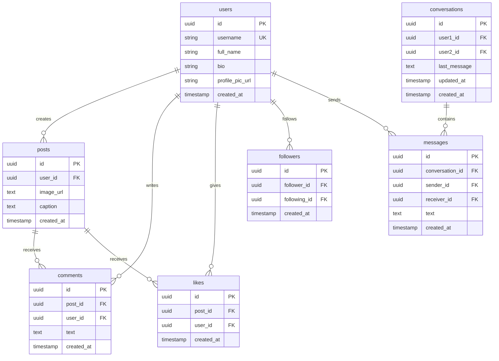

# 🗄️ Database & SQL Reference Guide

This document provides a comprehensive mapping of every database table, schema structure, and PostgreSQL query utilized across the **SocialGram (Instagram Clone)** application.

---

## 📋 Table of Contents
1. [Database Schema Overview](#1-database-schema-overview)
2. [Feed & Posts Queries](#2-feed--posts-queries)
3. [User Profiles & Search Queries](#3-user-profiles--search-queries)
4. [Followers & Following Queries](#4-followers--following-queries)
5. [Likes & Comments Queries](#5-likes--comments-queries)
6. [Direct Messaging (Chat) Queries](#6-direct-messaging-chat-queries)
7. [Authentication Security (Bcrypt Hashing)](#7-authentication-security-bcrypt-hashing)

---

## 1. Database Schema Overview



---

## 2. Feed & Posts Queries

### 2.1 Fetch Posts with Authors, Likes & Nested Comments
Used in **Home Feed (`FeedPosts.jsx`)**, **Profile Grid (`ProfilePage.jsx`)**, and **Explore (`ExplorePage.jsx`)**.

* **Supabase Client Call:**
```javascript
const { data, error } = await supabase
  .from("posts")
  .select("*, users(*), likes(*), comments(*, users(*))")
  .order("created_at", { ascending: false });
```

* **Underlying PostgreSQL Query:**
```sql
SELECT 
    p.id,
    p.user_id,
    p.image_url,
    p.caption,
    p.created_at,
    -- Joined post creator profile
    json_build_object(
        'id', u.id,
        'username', u.username,
        'full_name', u.full_name,
        'profile_pic_url', u.profile_pic_url
    ) AS users,
    -- Aggregated array of likes
    COALESCE(
        (SELECT json_agg(json_build_object('id', l.id, 'user_id', l.user_id))
         FROM likes l WHERE l.post_id = p.id), 
        '[]'::json
    ) AS likes,
    -- Aggregated array of comments along with commenter author profiles
    COALESCE(
        (SELECT json_agg(
            json_build_object(
                'id', c.id,
                'text', c.text,
                'created_at', c.created_at,
                'users', json_build_object(
                    'username', cu.username,
                    'profile_pic_url', cu.profile_pic_url
                )
            )
            ORDER BY c.created_at ASC
         )
         FROM comments c
         JOIN users cu ON cu.id = c.user_id
         WHERE c.post_id = p.id), 
        '[]'::json
    ) AS comments
FROM posts p
JOIN users u ON u.id = p.user_id
ORDER BY p.created_at DESC;
```

---

### 2.2 Create a New Post
Used in **`CreatePostModal.jsx`**.

* **Supabase Client Call:**
```javascript
const { data, error } = await supabase
  .from("posts")
  .insert([{ user_id: user.id, image_url: publicUrl, caption: caption.trim() }])
  .select("*, users(*), likes(*), comments(*)")
  .single();
```

* **Underlying PostgreSQL Query:**
```sql
INSERT INTO posts (user_id, image_url, caption)
VALUES ('00000000-0000-0000-0000-000000000000', 'https://...image.jpg', 'My new post!')
RETURNING *;
```

---

### 2.3 Delete a Post
Used in **`ProfilePost.jsx`**.

* **Supabase Client Call:**
```javascript
await supabase
  .from("posts")
  .delete()
  .eq("id", post.id)
  .eq("user_id", user.id);
```

* **Underlying PostgreSQL Query:**
```sql
DELETE FROM posts 
WHERE id = 'post_uuid_here' 
  AND user_id = 'authenticated_user_uuid';
```

---

## 3. User Profiles & Search Queries

### 3.1 Fetch User Profile by Username
Used in **`ProfilePage.jsx`**.

* **Supabase Client Call:**
```javascript
const { data, error } = await supabase
  .from("users")
  .select("*")
  .eq("username", username)
  .single();
```

* **Underlying PostgreSQL Query:**
```sql
SELECT * FROM users 
WHERE username = 'kunal' 
LIMIT 1;
```

---

### 3.2 Update User Profile
Used in **`EditProfileModal.jsx`**.

* **Supabase Client Call:**
```javascript
await supabase
  .from("users")
  .update({
    full_name: inputs.fullName,
    bio: inputs.bio,
    profile_pic_url: avatarUrl,
  })
  .eq("id", user.id);
```

* **Underlying PostgreSQL Query:**
```sql
UPDATE users 
SET 
    full_name = 'Kunal Mhatre',
    bio = 'Building with React & Supabase',
    profile_pic_url = 'https://...avatar.jpg'
WHERE id = 'authenticated_user_uuid';
```

---

### 3.3 Search Registered Users
Used in **`NewChatModal.jsx`** and **`SeeAllModal.jsx`**.

* **Supabase Client Call:**
```javascript
const { data, error } = await supabase
  .from("users")
  .select("*")
  .neq("id", user.id)
  .or(`username.ilike.%${query}%,full_name.ilike.%${query}%`)
  .limit(10);
```

* **Underlying PostgreSQL Query:**
```sql
SELECT id, username, full_name, profile_pic_url 
FROM users 
WHERE id != 'current_user_uuid'
  AND (username ILIKE '%query%' OR full_name ILIKE '%query%')
LIMIT 10;
```

---

## 4. Followers & Following Queries

### 4.1 Follow / Unfollow Toggle
Used in **`ProfileHeader.jsx`**, **`SuggestedUser.jsx`**, and **`FollowListModal.jsx`**.

* **Follow (Insert):**
```sql
INSERT INTO followers (follower_id, following_id) 
VALUES ('current_user_uuid', 'target_user_uuid');
```

* **Unfollow (Delete):**
```sql
DELETE FROM followers 
WHERE follower_id = 'current_user_uuid' 
  AND following_id = 'target_user_uuid';
```

---

### 4.2 Exact Follower & Following Counts
Used in **`ProfilePage.jsx`**.

```sql
-- Total followers of a profile (users who follow this profile)
SELECT COUNT(*) FROM followers 
WHERE following_id = 'profile_user_uuid';

-- Total accounts this profile follows
SELECT COUNT(*) FROM followers 
WHERE follower_id = 'profile_user_uuid';
```

---

### 4.3 Retrieve Follower List with User Details (Modal)
Used in **`FollowListModal.jsx`**.

```sql
-- Followers List
SELECT 
    u.id, 
    u.username, 
    u.full_name, 
    u.profile_pic_url 
FROM followers f
JOIN users u ON u.id = f.follower_id
WHERE f.following_id = 'target_user_uuid';

-- Following List
SELECT 
    u.id, 
    u.username, 
    u.full_name, 
    u.profile_pic_url 
FROM followers f
JOIN users u ON u.id = f.following_id
WHERE f.follower_id = 'target_user_uuid';
```

---

## 5. Likes & Comments Queries

### 5.1 Like / Unlike Post
Used in **`PostFooter.jsx`**.

* **Like:**
```sql
INSERT INTO likes (post_id, user_id) 
VALUES ('post_uuid', 'current_user_uuid');
```

* **Unlike:**
```sql
DELETE FROM likes 
WHERE post_id = 'post_uuid' 
  AND user_id = 'current_user_uuid';
```

---

### 5.2 Add Comment to a Post
Used in **`PostFooter.jsx`** & displayed in **`ExplorePage.jsx`** and **`ProfilePost.jsx`**.

* **Supabase Client Call:**
```javascript
const { data, error } = await supabase
  .from("comments")
  .insert([{ post_id: post.id, user_id: user.id, text: comment.trim() }])
  .select("*, users(*)")
  .single();
```

* **Underlying PostgreSQL Query:**
```sql
WITH inserted AS (
    INSERT INTO comments (post_id, user_id, text) 
    VALUES ('post_uuid', 'current_user_uuid', 'Amazing post!')
    RETURNING *
)
SELECT 
    i.id,
    i.post_id,
    i.user_id,
    i.text,
    i.created_at,
    json_build_object(
        'id', u.id,
        'username', u.username,
        'profile_pic_url', u.profile_pic_url
    ) AS users
FROM inserted i
JOIN users u ON u.id = i.user_id;
```

---

## 6. Direct Messaging (Chat) Queries

### 6.1 Retrieve Active Conversations
Used in **`ConversationList.jsx`**.

```sql
SELECT * FROM conversations 
WHERE user1_id = 'current_user_uuid' 
   OR user2_id = 'current_user_uuid'
ORDER BY updated_at DESC;
```

---

### 6.2 Fetch Messages Inside a Chat
Used in **`ChatArea.jsx`**.

```sql
SELECT 
    id,
    conversation_id,
    sender_id,
    receiver_id,
    text,
    created_at
FROM messages 
WHERE conversation_id = 'conversation_uuid'
ORDER BY created_at ASC;
```

---

### 6.3 Send a Chat Message
Used in **`ChatArea.jsx`**.

```sql
-- 1. Insert message row
INSERT INTO messages (conversation_id, sender_id, receiver_id, text) 
VALUES ('conversation_uuid', 'sender_uuid', 'receiver_uuid', 'Hello there!');

-- 2. Update parent conversation metadata
UPDATE conversations 
SET 
    last_message = 'Hello there!',
    updated_at = NOW()
WHERE id = 'conversation_uuid';
```

---

## 7. Authentication Security (Bcrypt Hashing)

User login credentials are not stored in the `public` schema. They are safeguarded inside the protected PostgreSQL system schema:

* **Location:** `auth.users`
* **Column:** `encrypted_password`
* **Algorithm:** One-way **bcrypt** cryptographic hash with random salting.

```sql
-- View user auth records (admin only)
SELECT id, email, encrypted_password, created_at, last_sign_in_at 
FROM auth.users;
```

> **Security Note:** Bcrypt is mathematically irreversible. Authentication works by calculating the hash of the newly typed password and comparing it against the stored hash digest. Plaintext passwords can never be decrypted.
